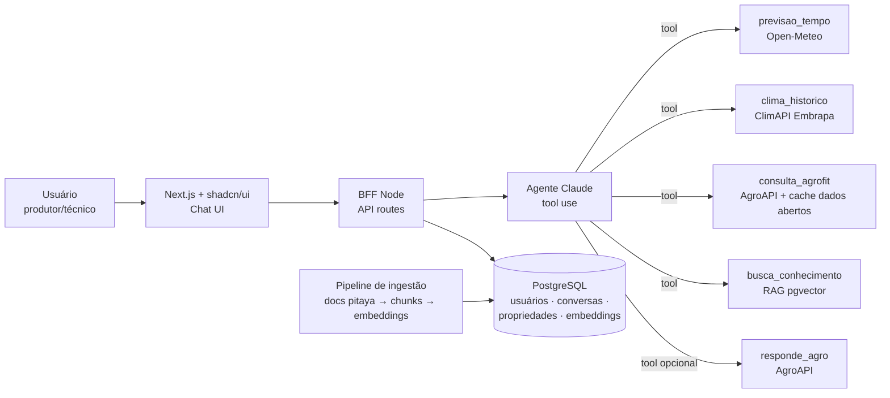

# Handoff de Produto — Chat IA de Manejo da Pitaya

> Documento de descoberta inicial. Nenhuma implementação começa antes da aprovação deste handoff.
> Data: 2026-07-30 · Status: **APROVADO em 2026-07-30** (com ajuste: provedor de LLM configurável — Anthropic ou OpenAI)

---

## 1. Problema

Produtores e técnicos que trabalham com pitaya não têm uma fonte única e confiável para decisões de manejo. A informação está espalhada em:

- Dados climáticos (Embrapa, INMET, previsões) que exigem interpretação técnica;
- Registros fitossanitários (Agrofit/MAPA) difíceis de consultar — saber qual produto é registrado para a cultura e a praga é trabalhoso;
- Conhecimento agronômico da pitaya (fenologia, poda, indução floral, doenças como antracnose e podridão de cladódio) disperso em publicações técnicas.

Resultado: decisões de irrigação, pulverização e nutrição tomadas por intuição, com risco de perda de produção e uso irregular de defensivos.

## 2. Usuários / público-alvo

| Perfil | Necessidade principal |
| --- | --- |
| **Produtor de pitaya** (primário) | Respostas práticas: "posso pulverizar amanhã?", "que produto é registrado para antracnose em pitaya?" |
| Técnico agrícola / agrônomo consultor | Consulta rápida de registros Agrofit e dados climáticos por talhão/região |
| Gestor da fazenda (ex.: New Era Agro) | Histórico de recomendações e visão de condições da lavoura |

## 3. Objetivo desta iteração (MVP)

Entregar um **chat conversacional em português** que responde perguntas de manejo da pitaya combinando, via tool use (function calling) do Claude:

1. Clima atual e previsão para a localização da fazenda;
2. Consulta de produtos fitossanitários registrados (Agrofit);
3. Base própria de conhecimento sobre pitaya (RAG);
4. Recomendações que cruzam essas fontes (ex.: janela de pulverização = previsão de chuva + vento + produto registrado).

## 4. Fontes de dados e APIs

| Fonte | O que fornece | Papel no MVP | Acesso |
| --- | --- | --- | --- |
| **AgroAPI – Embrapa** (plataforma) | Guarda-chuva das APIs Embrapa abaixo | Porta de entrada única | Cadastro gratuito em agroapi.cnptia.embrapa.br → token |
| **ClimAPI – Embrapa** | Temperatura, chuva, umidade, vento, evaporação, umidade do solo | Tool `clima_historico` | Token AgroAPI |
| **API Agrofit – Embrapa/MAPA** | Produtos registrados, ingredientes ativos, indicações de uso | Tool `consulta_agrofit` | Token AgroAPI |
| **API Responde Agro – Embrapa** | Busca em conteúdo técnico Embrapa | Tool `responde_agro` (fallback quando a base própria não cobre) | Token AgroAPI |
| **Dados Abertos Agrofit** (CSV/JSON) | Dump estruturado dos registros fitossanitários | **Plano B / cache local** se a API Agrofit for instável ou limitada | Download público (dados.agricultura.gov.br) |
| **Previsão meteorológica** (Open-Meteo como default) | Previsão horária/diária 7–14 dias | Tool `previsao_tempo` | Open-Meteo: gratuita, sem chave. Alternativas: INMET, OpenWeather |
| **Banco próprio de conhecimento** | Fenologia, poda, indução floral, pragas/doenças, nutrição da pitaya | **RAG** — coração do produto | Curadoria própria (documentos → chunks → embeddings no PostgreSQL/pgvector) |

**Premissa a validar:** os tokens da AgroAPI exigem cadastro (gratuito para volume baixo). Sem eles, o MVP roda com Open-Meteo + dados abertos Agrofit + RAG próprio — ou seja, nenhuma fonte é bloqueante.

## 5. Escopo MVP

- Chat web (pt-BR) com histórico de conversa por usuário.
- Agente Claude com **4 tools**: `previsao_tempo`, `clima_historico`, `consulta_agrofit`, `busca_conhecimento` (RAG). Responde Agro entra como 5ª tool se o token estiver disponível.
- Base de conhecimento inicial: ~10–20 documentos técnicos sobre pitaya (Embrapa, IAC, literatura) ingeridos via pipeline simples (upload → chunking → embedding → pgvector).
- Cadastro mínimo da propriedade: nome + coordenadas (lat/lon) para as consultas de clima.
- Citação de fontes nas respostas (qual API/documento embasou a recomendação).
- Aviso legal fixo: recomendações de defensivos exigem receituário agronômico — o chat informa registros, não prescreve.

## 6. Não-escopo (desta iteração)

- App mobile nativo (web responsivo atende).
- Multi-cultura (só pitaya).
- Mapas/talhões georreferenciados, NDVI, imagens de satélite.
- Alertas proativos/push (fase 2).
- Multi-tenancy comercial (1 organização no MVP).
- Fine-tuning de modelo — RAG resolve.
- Integração com ERP/estoque de insumos.

## 7. Decisões relevantes

| Decisão | Escolha | Por quê |
| --- | --- | --- |
| Arquitetura do agente | **Claude + tool use** (não pipeline fixo) | O modelo decide quais fontes consultar por pergunta; extensível |
| Modelo / provedor | **Configurável por env: Anthropic (Claude Sonnet) ou OpenAI (GPT)** — camada de abstração de provedor no backend | Decisão do usuário na aprovação; evita lock-in |
| Embeddings (RAG) | OpenAI `text-embedding-3-small` quando houver chave; **fallback para busca full-text (tsvector)** sem chave | Anthropic não oferece API de embeddings; o RAG nunca fica bloqueado |
| RAG | PostgreSQL + **pgvector** | Um banco só para dados relacionais e vetores; sem serviço extra |
| Stack | **Next.js + shadcn/ui** (front) · BFF em API routes/Node (back) · PostgreSQL | Padrão dos agentes de arquitetura deste workspace |
| Previsão do tempo | **Open-Meteo** como default | Gratuita, sem chave, boa cobertura no Brasil; troca fácil depois |
| Agrofit | API AgroAPI com **cache local dos dados abertos** | Resiliência: dump público garante funcionamento offline da fonte crítica |
| Idioma | pt-BR em toda a interface e respostas | Público-alvo |

## 8. Critérios de aceite

1. Perguntar *"vai dar pra pulverizar nos próximos 3 dias?"* → resposta usa previsão real da coordenada cadastrada, cita chuva/vento e a janela recomendada.
2. Perguntar *"qual produto registrado para antracnose em pitaya?"* → resposta lista produtos/ingredientes ativos vindos do Agrofit (API ou dados abertos), com aviso de receituário.
3. Perguntar sobre poda/indução floral → resposta cita documento da base própria (RAG) com referência visível.
4. Pergunta fora do domínio agro → o chat recusa educadamente e volta ao tema.
5. Histórico de conversa persiste entre sessões do mesmo usuário.
6. Falha de uma API externa não derruba o chat — o agente informa a indisponibilidade e usa as demais fontes.

## 9. Arquitetura proposta (visão macro)

## 10. Agentes recomendados (ordem de atuação após aprovação)

1. **data-architecture** — modelagem PostgreSQL: usuários, propriedades, conversas, mensagens, documentos, chunks/embeddings, cache Agrofit.
2. **backend-architecture** — BFF, loop do agente Claude, definição das tools, clientes das APIs externas, pipeline de ingestão.
3. **frontend-architecture** — chat UI (streaming, citações de fonte, histórico), cadastro de propriedade.

## 11. Premissas registradas

- Fazenda(s) em localização única conhecida no cadastro (não precisa de geocoding avançado no MVP).
- Volume baixo de usuários no MVP (< 20) — sem preocupação de escala ainda.
- Chave da API Claude (Anthropic) será fornecida pelo usuário.
- Cadastro na AgroAPI Embrapa será feito pelo usuário (gratuito); até lá, plano B cobre as funções críticas.

---

## 12. O que mudou desde a aprovação

Este handoff é o registro do que foi aprovado em 2026-07-30 e fica como está.
O que veio depois, e onde ler:

| Mudança | Quando | Onde está documentado |
| --- | --- | --- |
| Base **Bioinsumos** (AgroAPI) coletada e consultada em SQL, com página própria | ago/2026 | [01](01-arquitetura-dados.md), [README](../README.md) |
| Coleta da **API Agrofit** inteira para o Postgres, além do CSV dos Dados Abertos | ago/2026 | [01](01-arquitetura-dados.md) |
| **Ditado por voz** no campo de pergunta | ago/2026 | [09](09-ditado-por-voz.md) |
| Ingestão automática de `.md` novo em `data/conhecimento/` | ago/2026 | [04](04-estrutura.md) |
| Provedor de LLM passou de dois para **quatro** (Anthropic, OpenAI, OpenRouter, NVIDIA) | ago/2026 | [08](08-openrouter.md), [10](10-nvidia.md) |
| Troca de provedor e modelo por **painel no chat**, gravada no banco, sem reiniciar | 2026-08-23 | [README](../README.md#trocando-de-modelo), [05](05-api-http.md) |
| **Histórico de conversas** na interface: listar, reabrir e apagar | 2026-08-23 | [05](05-api-http.md), [01](01-arquitetura-dados.md) |

Duas premissas da seção 11 envelheceram: a chave da Anthropic deixou de ser
obrigatória (qualquer um dos quatro provedores serve, e dois têm cota
gratuita), e o "Agente Claude" do diagrama é hoje um agente com provedor
trocável — o contrato neutro em `src/server/llm/types.ts` é o que as tools
enxergam.
