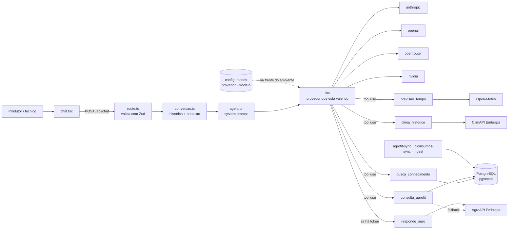
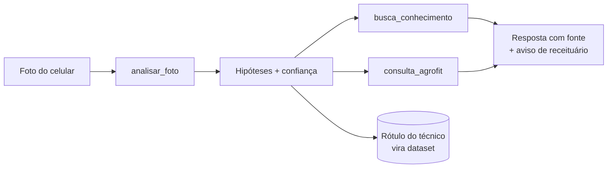

# Panorama técnico e caminho de deep learning

> Retrato do que o projeto é hoje — linguagem, estrutura, arquitetura e escopo
> entregue — seguido das duas frentes de deep learning escolhidas para a
> próxima fase: **casamento semântico de vocabulário** e **visão computacional**.
>
> Complementa, não substitui: [00-handoff-produto.md](00-handoff-produto.md) é a
> decisão de produto, [01-arquitetura-dados.md](01-arquitetura-dados.md) o
> modelo de dados e [04-estrutura.md](04-estrutura.md) a organização das pastas.

---

## 1. O produto

Chat conversacional em pt-BR sobre **manejo da pitaya** (*Hylocereus* spp. e
*Selenicereus* spp.), para produtores e técnicos.

O problema, como registrado no handoff: a informação que sustenta uma decisão de
manejo está partida em três fontes que não conversam — dados climáticos, o
cadastro fitossanitário do MAPA e a literatura técnica da cultura. O produtor
acaba decidindo irrigação e pulverização por intuição, com risco de perda de
produção e uso irregular de defensivo.

A resposta do produto é reunir as três fontes atrás de um agente que decide, por
pergunta, quais consultar — e que **sempre cita de onde veio o dado**.

| | |
| --- | --- |
| Status | MVP aprovado em 30/07/2026 |
| Cultura | Somente pitaya (multi-cultura é não-escopo) |
| Público | Produtor (primário), técnico/agrônomo, gestor da fazenda |
| Idioma | pt-BR em toda a interface e nas respostas |

---

## 2. Linguagem e stack

Projeto **TypeScript de ponta a ponta**, sem serviço em outra linguagem.

| Camada | Tecnologia | Versão |
| --- | --- | --- |
| Linguagem | TypeScript | ^7.0.2 |
| Framework | Next.js (App Router) | ^16.2.12 |
| UI | React + Tailwind | ^19.2.8 · ^4.3.3 |
| Banco | PostgreSQL via `pgvector/pgvector:pg17` | pg17 |
| ORM / migrações | Drizzle ORM + drizzle-kit | ^0.45.2 · ^0.31.10 |
| Validação | Zod | ^4.4.3 |
| LLM | `@anthropic-ai/sdk` e `openai` (este também serve OpenRouter e NVIDIA) | ^0.115.0 · ^7.2.0 |
| Scripts | tsx (execução direta de `.ts`) | ^4.23.1 |

Extensões Postgres em uso: `pgcrypto`, `vector`, `pg_trgm`, `unaccent`.

**Volume atual:** ~7.900 linhas de TS/TSX em `src/` e `scripts/`, 5 migrações
SQL, 13 documentos de conhecimento.

### Por que provedor de LLM configurável

Decisão tomada na própria aprovação do handoff: a camada `src/server/llm/`
abstrai o fornecedor atrás de uma interface única (`llm/types.ts`). Evita
lock-in e permite trocar de modelo sem tocar nas tools.

São quatro provedores hoje — Anthropic, OpenAI, OpenRouter e NVIDIA — e a
escolha saiu do `.env` para um **painel no chat**: ela fica na tabela
`configuracoes`, tem precedência sobre o ambiente e vale na pergunta seguinte,
sem reiniciar o servidor. O `.env` continua sendo o padrão de partida e guarda
as chaves, que não passam pelo painel.

A razão prática apareceu rápido: conta sem crédito derruba o chat inteiro, e
cada provedor tem a sua cota. OpenRouter e NVIDIA têm modelos gratuitos, o que
mantém a aplicação demonstrável sem custo — e com dois cadastrados, a cota de
um acabar é uma troca no painel.

O que o provedor precisa saber fazer é **tool calling**. Sem isso o agente
responde de memória em vez de consultar Agrofit, clima e a base — por isso o
painel só oferece modelos com esse suporte, e `npm run llm:test` verifica
exatamente essas duas coisas: a chave autentica e o modelo chama ferramenta.

---

## 3. Estrutura de pastas

Cinco camadas, uma pasta cada — front, back, rotas, banco e documentação.

```
IA PITAYA/
├── src/
│   ├── app/                     roteamento Next (páginas e rotas HTTP, ambas finas)
│   │   ├── page.tsx · agrofit/ · bioinsumos/
│   │   └── api/                 chat · conversas · llm · agrofit · bioinsumos · propriedades
│   ├── frontend/                componentes "use client" (chat + painéis, agrofit, bioinsumos)
│   ├── instrumentation.ts       gancho do Next: observador da base de conhecimento
│   └── server/                  regra de negócio
│       ├── agent.ts             system prompt + loop do agente
│       ├── llm/                 4 provedores atrás de um contrato neutro
│       ├── tools/               4 tools, +1 quando há token da AgroAPI
│       ├── agroapi/             credencial e paginação do gateway Embrapa
│       ├── agrofit/             api.ts (coleta) · busca.ts (consulta local)
│       ├── bioinsumos/          api.ts (coleta) · busca.ts (consulta local)
│       ├── db/                  schema Drizzle + pool
│       ├── embeddings.ts        embeddings com degradação para full-text
│       ├── ingestao.ts          recorte em trechos + ingestão da base de conhecimento
│       └── conversas.ts         rodada de chat + histórico de conversas
├── banco/
│   ├── docker-compose.yml       Postgres + Adminer (atrás de profile)
│   └── migracoes/               0000_init · 0001_agrofit_api · 0002_bioinsumos · 0003_unaccent · 0004_configuracoes
├── scripts/                     migrate · ingest · agrofit-sync · bioinsumos-sync · llm-test
├── data/conhecimento/           base própria em .md que alimenta o RAG
└── docs/                        esta documentação
```

Duas regras estruturais que o projeto sustenta hoje:

- **`src/app` guarda só roteamento.** Em Next a pasta é a rota, então os
  arquivos não podem sair dali — mas `page.tsx` só importa componente e define
  `metadata`, e `route.ts` só valida entrada, chama `src/server` e monta a
  resposta. Nenhum arquivo de rota contém SQL ou `fetch` de terceiro.
- **`src/frontend` nunca importa `src/server`.** Fala com o back só por `fetch`
  em `/api`, porque `src/server` roda com segredos e conexão de banco.

---

## 4. Arquitetura



### O agente

Não é pipeline fixo: o modelo recebe as tools e decide quais chamar. O system
prompt em [`agent.ts`](../src/server/agent.ts) carrega as regras que o domínio
exige:

- responder primeiro, embasar depois — "o produtor quer saber o que fazer, não
  uma aula";
- **não responder de memória** sobre clima, produto registrado ou prática de
  manejo — usar a tool;
- informar registro no MAPA, **nunca** prescrever dose, calda ou intervalo de
  aplicação, e repetir a exigência de receituário agronômico;
- quando não houver produto registrado para a combinação perguntada, **dizer
  isso** em vez de sugerir produto de outra cultura — a pitaya tem poucos
  registros, e essa é a resposta correta com mais frequência do que parece;
- se uma tool falhar, informar a indisponibilidade e responder com o resto.

### As tools

| Tool | Fonte | Observação |
| --- | --- | --- |
| `busca_conhecimento` | base própria (pgvector) | fonte primária de manejo |
| `previsao_tempo` | Open-Meteo | sem chave |
| `clima_historico` | ClimAPI Embrapa | exige token AgroAPI |
| `consulta_agrofit` | cópia local do Agrofit + API | local primeiro |
| `responde_agro` | AgroAPI | **só é registrada se houver token** |

A última linha é uma decisão deliberada: expor uma tool que sempre falha degrada
a escolha do modelo.

### Duas decisões de resiliência que valem destaque

**Base local como fonte primária do Agrofit.** A cópia sincronizada responde em
milissegundos e não gasta cota; a API entra só quando a base ainda não foi
sincronizada. Para isso, `estadoDaBase()` distingue *"não existe registro"* de
*"a base não foi carregada"* — sem essa distinção a tool teria que hedgear todo
resultado vazio, e o hedge apagaria justamente a informação que mais importa na
pitaya: a de que realmente não há produto.

**RAG que nunca fica inacessível.** Com `OPENAI_API_KEY`, busca vetorial por
cosseno em `pgvector`; sem a chave, cai para full-text (`tsvector` em
português). O produto continua de pé rodando só com Anthropic — ao custo de
qualidade de recuperação, e esse custo é um dos motivos da Escolha A adiante.

---

## 5. O que já faz

- **Chat com tool use e histórico persistente**, com citação de fonte por
  mensagem (`messages.sources` em `jsonb`, exibido na UI). O painel "Conversas"
  lista, reabre e apaga conversas anteriores; a conversa só é gravada depois de
  uma resposta completa, então falha de provedor não deixa entrada morta.
- **Troca de provedor e modelo de LLM pela interface**, sem reiniciar o
  servidor — quatro provedores, dois deles com cota gratuita.
- **Ditado por voz** no campo de pergunta, para uso com uma mão só no campo.
- **Consulta ao Agrofit** por cultura, alvo, ingrediente ativo, titular e
  classe, com paginação. O casamento de cultura + praga é feito por `EXISTS`
  sobre `agrofit_indicacoes` para garantir que ambos estão **na mesma indicação
  de uso** — cruzar as colunas agregadas do produto encontraria registro para
  aquela praga em outra cultura, que é erro grave no contexto.
- **Módulo de bioinsumos** — o recorte biológico do mesmo cadastro do MAPA, com
  coleta, tabelas normalizadas e front próprio (o maior componente do projeto,
  673 linhas).
- **Sincronização das bases** por script, guardando o payload cru em
  `agrofit_itens` / `bioinsumos_itens` — seguro contra mudança de layout da
  fonte, permite remapear sem baixar tudo de novo.
- **RAG sobre base curada** (`data/conhecimento/*.md` → chunks de ~1.200
  caracteres com 150 de sobreposição → embeddings), reingestão idempotente por
  título.
- **Cadastro de propriedade** com lat/lon, usado como contexto climático da
  conversa.
- **Previsão e histórico climático** por coordenada da propriedade.

### Estado dos dados

| Conjunto | Situação |
| --- | --- |
| Base de conhecimento | 13 arquivos, ~1.900 linhas — os seis originais de partida mais material convertido de PDF (cartilhas, boletins e um livro sobre pitaya) |
| Agrofit | sincronizado do dump/API, com vocabulário canônico (culturas, pragas, ingredientes, titulares) |
| Bioinsumos | coleção normalizada + payload cru |
| Fotos de campo | **não existe** — o produto é 100% texto hoje |

---

## 6. Onde o deep learning já está — e onde não está

Duas peças do produto já são deep learning, ambas consumidas por API: o **LLM**
e os **embeddings** (`text-embedding-3-small`, um transformer). Nenhum modelo é
do projeto.

O handoff colocou **fine-tuning no não-escopo**, com a justificativa "RAG
resolve". Está correto: fine-tunar LLM para injetar conhecimento é caro,
desatualiza e apaga a rastreabilidade da fonte — que aqui é requisito, não
enfeite. As duas frentes abaixo **não tocam no LLM**, e por isso não conflitam
com aquela decisão.

---

## 7. Escolha A — Casamento semântico de vocabulário

**Custo: dias. Conserta um erro que o próprio código já documenta.**

### O problema, com a evidência

O comentário da função `vocabulario()` em
[`agrofit/busca.ts`](../src/server/agrofit/busca.ts) registra o motivo de ela
existir:

> a busca é ILIKE sobre o nome exato, então "pitaia" ou "fruta-do-dragão" não
> acham a cultura que o MAPA registra como "Pitaya" — e o usuário leria isso
> como "não há produto".

A mitigação atual é autocompletar os filtros no front com as listas canônicas.
Resolve a tela — **não resolve o agente**. A tool `consulta_agrofit` recebe
`cultura` e `alvo` como texto livre gerado pelo modelo a partir do que o
produtor escreveu, e o produtor escreve "podridão do pé", não
"*Bipolaris cactivora*".

A camada de tolerância que existe hoje cobre acento, não sinônimo: a migração
`0003_unaccent` foi criada porque, ao trocar a filtragem em JavaScript por
Postgres, `ILIKE` puro deixaria de achar "ação" ao digitar "acao" — e isso seria
regressão silenciosa. Vale notar que `unaccent` está aplicado em
`bioinsumos/busca.ts`, **e não** em `agrofit/busca.ts`.

O modo de falha é o pior possível neste domínio: **dizer "não há produto
registrado" quando há**. É indistinguível, para o usuário, da resposta correta —
que na pitaya é frequentemente "realmente não existe".

### A solução

Embedar os vocabulários canônicos que **já estão no banco** e resolver o termo
do usuário por similaridade antes de chegar ao `ILIKE`.

```sql
CREATE TABLE vocabulario_canonico (
  id          serial PRIMARY KEY,
  colecao     text NOT NULL,   -- 'culturas' | 'pragas' | 'ingredientes'
  termo       text NOT NULL,   -- como o MAPA registra
  sinonimo_de text,            -- nome científico <-> nome comum
  embedding   vector(1536),
  UNIQUE (colecao, termo)
);
CREATE INDEX ON vocabulario_canonico USING hnsw (embedding vector_cosine_ops);
```

Fluxo dentro da tool:

1. termo livre → embedding;
2. top-3 por cosseno dentro da coleção certa;
3. **acima do limiar e com margem folgada sobre o 2º** → usa o termo canônico e
   informa ao modelo qual termo foi usado;
4. **abaixo do limiar ou com margem apertada** → não escolhe: devolve as
   sugestões para o agente perguntar ("você quis dizer antracnose ou podridão de
   cladódio?").

O passo 4 é a parte que não pode ser cortada. Trocar "podridão do pé" por um
nome científico **silenciosamente** transforma um erro de busca em uma
recomendação errada de defensivo, que é exatamente o dano que o produto existe
para evitar. Pragas de nome parecido e alvo diferente — mosca-branca e
mosca-das-frutas — são o caso de teste obrigatório.

### Como medir

Montar com o responsável técnico uma lista de ~50 termos como o produtor
realmente escreve, com o termo canônico esperado de cada um. Métrica: acerto em
top-1 do `ILIKE` de hoje contra o casamento vetorial, e — mais importante —
quantos "nenhum resultado" viram resposta correta.

### Custo e riscos

| | |
| --- | --- |
| Esforço | dias; uma tabela, um script de embedding em lote, uma função de resolução |
| Custo recorrente | embedar alguns milhares de termos uma vez; reembedar só o que o sync trouxer de novo |
| Infra nova | nenhuma — `pgvector` e HNSW já estão instalados e em uso |
| Risco | falso casamento entre pragas próximas → mitigado por limiar + margem + devolver sugestão em vez de decidir |

---

## 8. Escolha B — Visão computacional

**O salto de produto. Começa sem treinar nada e constrói o próprio dataset.**

### Por que

O chat é 100% texto, e é exatamente aí que ele deixa o produtor na mão: ele está
no campo, com uma mancha no cladódio e um celular na mão. Antracnose, podridão
de cladódio, mancha bacteriana e escaldadura de sol se distinguem mal por
descrição verbal e bem por imagem — descrever "mancha marrom com halo amarelo"
é onde a busca textual erra o alvo.

Do diagnóstico em diante, **o produto já está pronto**: termo técnico →
`busca_conhecimento` + `consulta_agrofit` → produto registrado com o aviso de
receituário.



### Estágio 0 — multimodal, sem modelo próprio

Claude e GPT já aceitam imagem, e a abstração de provedor em `src/server/llm/`
já está no lugar. Uma tool `analisar_foto` entra sem treinar nada e sem GPU.

O ponto que decide o futuro da frente: **cada foto enviada, mais a confirmação
do técnico, é um par rotulado**. Guardar isso desde o primeiro dia é o que torna
o Estágio 1 possível — e é barato agora, caro depois.

```sql
CREATE TABLE fotos (
  id           uuid PRIMARY KEY DEFAULT gen_random_uuid(),
  message_id   uuid REFERENCES messages(id) ON DELETE SET NULL,
  property_id  uuid REFERENCES properties(id) ON DELETE SET NULL,
  caminho      text NOT NULL,
  tirada_em    timestamptz,
  hipoteses    jsonb,      -- saída do modelo: [{classe, confianca}]
  rotulo       text,       -- verdade confirmada pelo técnico
  rotulado_por uuid REFERENCES users(id),
  rotulado_em  timestamptz,
  created_at   timestamptz NOT NULL DEFAULT now()
);
```

### Estágio 1 — classificador próprio

Quando houver volume (~200–300 fotos por classe), backbone pré-treinado
congelado (**DINOv2** ou **ConvNeXt**) + *linear probe* sobre os embeddings de
imagem. Treino em minutos, roda em CPU na inferência, auditável, e sem custo por
chamada.

Classes iniciais propostas: antracnose · podridão de cladódio · mancha
bacteriana · escaldadura/queima de sol · deficiência nutricional · **sadio**.

O que **não** fazer: treinar CNN do zero ou fine-tunar o backbone inteiro com
esse volume — decora o conjunto e não generaliza.

**Nota de arquitetura:** este é o primeiro componente que não cabe em
TypeScript. A forma limpa é um serviço Python isolado (FastAPI) que o BFF chama
por HTTP, como já faz com Open-Meteo e AgroAPI — não tentar rodar torch em Node.
O Estágio 0 não tem esse custo; ele só aparece no Estágio 1, e é uma boa razão
para não antecipá-lo.

### Métrica correta

Acurácia global aqui engana, porque as classes serão desbalanceadas. O que
importa:

- **recall por classe**, especialmente das doenças que se espalham rápido — o
  falso negativo custa lavoura;
- **matriz de confusão** entre antracnose e podridão de cladódio, que é o par
  que o produtor confunde e o que muda a conduta;
- **top-2 contém a verdade** — coerente com um produto que sugere hipóteses,
  não que decide sozinho.

### Limites que ficam valendo

A tool sugere hipótese, **não diagnostica**. Confiança baixa vira "leve isso a
um agrônomo", e toda menção a defensivo continua passando pelo aviso de
receituário do system prompt. Nada disso muda com a foto — a foto só melhora a
pergunta que chega às outras tools.

### Isto contradiz o não-escopo?

Não. O que o handoff descartou foi **NDVI e imagem de satélite**, que é
sensoriamento remoto em talhão — outra fonte, outro custo, outra escala. Foto de
celular apontada para a planta é produto diferente, e é o que o produtor
consegue fazer sozinho, hoje, sem equipamento.

O diferencial real: a New Era Agro é a operação de vocês. Foto de campo com
rótulo do agrônomo é um dataset de pitaya que não existe pronto no mercado.

### E por drone?

Estudado à parte em
[07-drone-visao-computacional.md](07-drone-visao-computacional.md). Resumo: o
drone **não** diagnostica doença na pitaya — a copa pende do poste e o nicho da
antracnose e da podridão é o ponto cego do voo vertical. Ele serve como camada
**anterior** a esta: diz em qual planta olhar, e o diagnóstico continua sendo
da câmera a 30 cm da lesão. É a frente mais cara das três e não passa na frente
destas duas.

---

## 9. Ordem sugerida

| # | Frente | Esforço | Destrava |
| --- | --- | --- | --- |
| 1 | Casamento semântico de vocabulário | dias | conserta o "não há produto" falso; infra já existe |
| 2 | Visão — Estágio 0 (multimodal + coleta de rótulo) | semanas | abre o caso de uso novo **e** constrói o dataset |
| 3 | Visão — Estágio 1 (classificador próprio) | quando houver ~1.000 fotos rotuladas | tira custo por chamada, ganha precisão no domínio |

A ordem não é arbitrária: a Escolha A rende valor imediato com risco quase nulo,
e o Estágio 0 da Escolha B precisa começar cedo **porque o dataset leva tempo
para existir** — cada semana sem coletar rótulo é uma semana empurrando o
Estágio 1 para frente.

## 10. O que fica de fora, e por quê

- **Rede neural para previsão do tempo.** Open-Meteo já entrega saída de modelo
  numérico que custa supercomputador. O valor está na regra agronômica sobre a
  previsão (chuva nas horas seguintes à aplicação, vento, UR), que é lógica de
  negócio — não modelo.
- **Série temporal fenológica** (prever indução floral ou janela de colheita a
  partir do histórico da fazenda). Ideia legítima, mas exige anos de clima
  casado com registro fenológico próprio. Fase 3; prometer antes do dado existir
  é como o projeto acumula dívida.
- **Fine-tuning do LLM.** Mantido no não-escopo, pelas razões do handoff.
