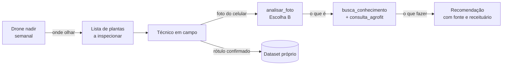

# Drone e visão computacional no pitayal — estudo de viabilidade

> Avalia usar drone com visão computacional para identificar doenças no pomar.
> **Veredito: viável, mas não para diagnosticar doença.** O obstáculo não é o
> modelo — é a geometria da cultura. O drone resolve outra camada, e essa
> camada tem valor próprio.
>
> Complementa [06-panorama-e-deep-learning.md](06-panorama-e-deep-learning.md),
> que define as duas frentes de deep learning já escolhidas. Este documento é
> uma **terceira frente candidata**, não uma substituição de nenhuma delas.
>
> Levantado em agosto/2026.

---

## 1. Veredito

| Pergunta | Resposta |
| --- | --- |
| Dá para diagnosticar antracnose por drone? | **Não** em operação real — só em faixa de voo que não escala |
| Dá para achar plantas com problema? | **Sim**, como anomalia por planta, em voo nadir barato |
| Dá para mapear risco fitossanitário? | **Sim** — adensamento de copa, encharcamento, falhas |
| Dá para achar formigueiro de saúva? | **Sim**, e é onde o drone é imbatível |
| Substitui a foto de celular da Escolha B? | **Não** — é a camada anterior a ela |
| Entra antes das Escolhas A e B? | **Não.** É a frente mais cara das três |

---

## 2. Por que a pitaya é o caso difícil

### A geometria trabalha contra o voo vertical

O [`02-poda-conducao.md`](../data/conhecimento/02-poda-conducao.md) descreve o
sistema de condução usual no Brasil: poste de 1,7–2,0 m com coroa no topo,
**onde os cladódios se apoiam e pendem**, a 3×3 m ou 3×2 m, com 1.000 a 1.600
plantas/ha.

Ou seja, a superfície produtiva é **vertical e pendente**. O drone em voo nadir
enxerga a tampa da copa — não a face lateral onde a lesão aparece.

### O nicho das doenças é exatamente o ponto cego

Cruzando com o [`04-doencas-pragas.md`](../data/conhecimento/04-doencas-pragas.md):

| Doença | Onde se instala | Visível de cima? |
| --- | --- | --- |
| Antracnose | favorecida por "copa adensada com pouca circulação de ar" — o interior sombreado | **Não** |
| Podridão de cladódio | "a partir de um ferimento ou do ponto de contato com o solo" — a base | **Não** |
| Mancha-parda | cladódios, ligada a estresse e queimadura de sol | Parcialmente |

As duas doenças principais da cultura se instalam justamente onde a câmera
aérea não alcança: o interior da copa e a base da planta.

### A matemática da resolução

```
GSD (mm/px) = (largura do sensor mm × altura m × 1000) ÷ (focal mm × largura px)
```

| Altura | Mavic 3 (4/3, 12,3 mm, 5280 px) | Mini 4 Pro 48MP (1/1.3", 6,7 mm, 8064 px) | Lesão 15 mm | Lesão 5 mm |
| --- | --- | --- | --- | --- |
| 30 m | 8,00 mm/px | 5,39 mm/px | ~2 px | <1 px |
| 20 m | 5,33 mm/px | 3,59 mm/px | ~3–4 px | ~1 px |
| 10 m | 2,67 mm/px | 1,80 mm/px | ~6–8 px | ~2–3 px |
| 5 m | 1,33 mm/px | 0,90 mm/px | ~11–17 px | ~4–6 px |
| 3 m | 0,80 mm/px | 0,54 mm/px | ~19–28 px | ~6–9 px |
| 2 m | 0,53 mm/px | 0,36 mm/px | ~28–42 px | ~9–14 px |

Regra prática: classificar (não só detectar) pede a lesão com **10–20 px** de
diâmetro. A lesão inicial de ~5 mm — o momento em que agir ainda adianta, que é
o que o `04-doencas-pragas.md` chama de "inspeção semanal permite agir cedo" —
só cruza esse limiar **abaixo de 3 m de altura**.

### A matemática da cobertura

É aqui que a ideia de varredura lateral morre.

| Modo | Altura | Rendimento | Bateria |
| --- | --- | --- | --- |
| **Nadir** (70% sobreposição lateral) | 30 m | **~2,6 min/ha** | 1 bateria ≈ 10 ha |
| **Lateral**, dois lados de cada fileira, 2 m/s | 2–3 m | **~56 min/ha** | 2 baterias/ha |
| **Lateral**, dois lados, 1,5 m/s | 2–3 m | **~74 min/ha** | 2–3 baterias/ha |
| **Lateral**, dois lados, 1,0 m/s | 2–3 m | **~111 min/ha** | 3–4 baterias/ha |

O voo lateral percorre **6,7 km por hectare** (33 fileiras × 100 m × 2 lados),
entre postes e arames.

### E ainda tem o arrasto de movimento

A 1,5 m/s com obturador em 1/500 s, a câmera se desloca 3 mm durante a
exposição — a 0,53 mm/px isso são **5,7 px de borrão**, que apaga exatamente a
lesão que se quer ver.

Obturador precisa ficar travado em **1/1600–1/2000 s**. Dá no sol pleno
brasileiro, mas restringe a janela de voo e proíbe dia nublado.

### Conclusão da parte técnica

Varredura lateral para enxergar lesão **funciona em 1 hectare de demonstração e
não escala para o pomar**. Não é limitação de software.

---

## 3. O que o drone faz bem nesta cultura

O espaçamento 3×3 m com 30–40% de cobertura de solo faz do pitayal, visto de
cima, **uma grade regular de objetos discretos** — o oposto de uma lavoura de
soja fechada. Segmentar planta a planta fica quase trivial, e isso destrava
métrica por indivíduo ao longo do tempo.

| # | O que mede | Ação que dispara |
| --- | --- | --- |
| 1 | **Inventário e falhas** — contagem, plantas mortas, mudas que não pegaram | replantio |
| 2 | **Área de copa por planta, série temporal** — vigor e, no sentido inverso, **adensamento** | **poda de arejamento** — que o próprio doc chama de "a principal ferramenta fitossanitária" |
| 3 | **Formigueiros de saúva** — solo revolvido é visível de cima; caso consolidado em silvicultura | manejo localizado no formigueiro, como já prescrito |
| 4 | **Encharcamento e falha de irrigação** — padrão de umidade e vigor por setor | drenagem; previne podridão de cladódio na base |
| 5 | **Progressão espacial** — onde as plantas sintomáticas se agrupam ao longo das semanas | decide se é foco isolado ou reboleira em expansão |

O item 2 merece destaque: o drone **não vê antracnose**, mas vê o *fator de
risco* dela. Copa fechada demais é microclima úmido, e mapear quais plantas
estão adensadas é priorização de poda — ação preventiva, que é a estratégia
central de uma cultura com pouquíssimos registros fitossanitários.

O item 5 é o único que nenhuma foto de celular entrega, porque é padrão de
campo, não de planta.

---

## 4. O que o drone não faz

| Alvo | Por quê | Quem resolve |
| --- | --- | --- |
| Distinguir antracnose de mancha-parda | escala milimétrica + contexto de lesão | foto de celular (Escolha B) |
| Podridão de cladódio na base | ocluída pela copa pendente | inspeção em campo |
| Cochonilha e ácaro nas aréolas | milimétrico, nas junções de cladódio | inspeção em campo |
| Mosca-das-frutas | a larva está **dentro** do fruto | armadilha McPhail, como o doc já prescreve |

Insistir em qualquer uma dessas quatro por via aérea é gastar orçamento no
lugar errado.

---

## 5. Como seria — arquitetura

Duas camadas com papéis distintos, e nenhuma substitui a outra:



**O produto do voo não é um diagnóstico — é uma rota de caminhada.** O princípio
nº 5 do manejo já é "inspeção semanal permite agir cedo"; o drone não substitui
essa inspeção, ele a torna **dirigida** em vez de amostral.

No chat isso não vira tela nova: vira **uma tool a mais**, no mesmo padrão das
outras cinco.

```
estado_do_pomar(talhao?, desde?)
  → plantas com anomalia no último voo, ordenadas por severidade
  → variação de área de copa vs. voo anterior
  → focos espaciais detectados
```

Assim o produtor pergunta *"o que eu inspeciono essa semana?"* e o agente
responde com a lista — e o técnico, ao fotografar a planta indicada, alimenta
exatamente o dataset rotulado que a Escolha B precisa. **As duas frentes se
retroalimentam.**

---

## 6. Três decisões que precisam vir antes do equipamento

### 6.1 Isto reabre uma decisão de produto

O [handoff](00-handoff-produto.md) colocou "mapas/talhões georreferenciados" no
**não-escopo**. Drone traz georreferenciamento junto — passam a existir talhão,
planta com identidade estável, voo e detecção no modelo de dados.

Não dá para adotar drone e manter aquele não-escopo. É uma escolha legítima,
mas precisa ser **explícita e aprovada**, não um efeito colateral.

### 6.2 RTK não é luxo — é requisito de identidade

GPS comum erra de 1 a 3 m. Com plantas espaçadas a 3 m, a detecção da semana que
vem pode cair na **planta vizinha** — e a série temporal por planta, que é todo
o valor da camada, se desfaz.

Três saídas, da mais cara para a mais esperta:

1. drone com **RTK** (precisão centimétrica);
2. **pontos de controle** no solo, medidos uma vez;
3. casar plantas pelo **padrão da grade** em vez da coordenada absoluta — mais
   barato e viável justamente porque o plantio é regular.

A opção 3 é a que eu testaria primeiro.

### 6.3 O banco não tem PostGIS hoje

A imagem `pgvector/pgvector:pg17` não traz PostGIS. Confirme:

```bash
docker exec -it pitaya-db psql -U pitaya -d pitaya -c "SELECT * FROM pg_available_extensions WHERE name LIKE 'postgis%';"
```

Se vier vazio, dois caminhos: **começar sem PostGIS** (planta como ponto
lat/lon, como já se faz em `properties`, mais um id estável) ou trocar por uma
imagem que traga PostGIS e pgvector juntos.

Coerente com o princípio do [`01-arquitetura-dados.md`](01-arquitetura-dados.md)
— "modela **somente** o exigido" — o primeiro caminho é o certo. PostGIS entra
quando aparecer polígono de talhão de verdade.

Esboço mínimo, sem PostGIS:

```sql
CREATE TABLE talhoes (
  id          uuid PRIMARY KEY DEFAULT gen_random_uuid(),
  property_id uuid NOT NULL REFERENCES properties(id) ON DELETE CASCADE,
  nome        text NOT NULL
);

CREATE TABLE plantas (
  id         uuid PRIMARY KEY DEFAULT gen_random_uuid(),
  talhao_id  uuid NOT NULL REFERENCES talhoes(id) ON DELETE CASCADE,
  fileira    int NOT NULL,      -- identidade pela grade, não pelo GPS
  posicao    int NOT NULL,
  latitude   double precision,
  longitude  double precision,
  UNIQUE (talhao_id, fileira, posicao)
);

CREATE TABLE voos (
  id         uuid PRIMARY KEY DEFAULT gen_random_uuid(),
  talhao_id  uuid NOT NULL REFERENCES talhoes(id) ON DELETE CASCADE,
  voado_em   timestamptz NOT NULL,
  altura_m   numeric,
  camera     text,
  gsd_mm_px  numeric,
  observacao text
);

CREATE TABLE deteccoes (
  id         uuid PRIMARY KEY DEFAULT gen_random_uuid(),
  voo_id     uuid NOT NULL REFERENCES voos(id) ON DELETE CASCADE,
  planta_id  uuid REFERENCES plantas(id) ON DELETE SET NULL,
  tipo       text NOT NULL,   -- 'anomalia' | 'falha' | 'formigueiro' | 'adensamento'
  severidade numeric,
  confianca  numeric,
  area_copa  numeric,
  recorte    text             -- caminho do crop, insumo da Escolha B
);
```

---

## 7. Onde entra deep learning — e onde não entra

**Quase nada desta camada precisa ser supervisionado no começo.** Vale insistir
nisso porque é onde projetos de visão em agro queimam orçamento.

| Tarefa | Abordagem certa no início | DL supervisionado quando |
| --- | --- | --- |
| Anomalia por planta | **z-score** sobre a série de área de copa e índice de verde | houver rótulo de campo suficiente |
| Segmentação de copa | limiar de excesso de verde + watershed (a grade é regular) | a segmentação clássica falhar em copa encostada |
| Formigueiro | detector supervisionado (YOLO), poucas centenas de exemplos | desde já — é objeto distinto no solo |
| Classificação de doença | **não fazer nessa camada** | nunca; é trabalho da foto de perto |

### O alerta sobre multiespectral

Tentador e prematuro. A pitaya é planta **CAM** — estômatos abertos à noite,
cutícula cerosa espessa — e índices tipo NDVI se comportam diferente do que a
literatura de soja e milho sugere. Pior: com 30–40% de cobertura de solo, o
pixel mistura planta e mato da entrelinha. **Sem segmentar a copa antes, você
mede o mato.**

Comece em RGB. Área de copa por planta já entrega a métrica principal, e a
câmera multiespectral custa várias vezes mais.

---

## 8. Regulatório — mudou em 2026

Parte da viabilidade, e a base normativa **mudou este ano**:

- Em **16/06/2026** a ANAC publicou a **Resolução nº 805**, aprovando o
  **RBAC 100**, que substitui integralmente o RBAC-E nº 94 (vigente desde 2017)
  e organiza as operações em três categorias: **Aberta**, **Específica** e
  **Certificada**.
- O **ICA 100-40** do DECEA entrou em vigor em **01/07/2026**, concentrando as
  regras de acesso ao espaço aéreo.

### Enquadramento do nosso caso

Drone abaixo de 25 kg, abaixo de 120 m, dentro da visada, em área rural própria,
sem pessoas não envolvidas → **categoria Aberta**, a mais simples. Ainda assim:

| Exigência | Detalhe |
| --- | --- |
| **SISANT** (ANAC) | cadastro da aeronave, renovação a cada 2 anos |
| **SARPAS** (DECEA) | solicitação de acesso ao espaço aéreo para **toda** operação ao ar livre — inclusive sub-250 g e inclusive em área rural remota. É a mudança mais relevante do ICA 100-40 para nós |
| **ANATEL** | homologação do equipamento de rádio |
| **Seguro** | responsabilidade civil, para uso não recreativo |

Voar além da visada (BVLOS) — tentador para cobrir área grande — joga na
categoria **Específica** e exige avaliação de risco operacional. Outro patamar
de burocracia; fora de cogitação nesta fase.

Pulverização por drone é assunto separado, com exigências próprias do MAPA, e
**não** faz parte deste estudo.

> **Confirme antes de comprar equipamento.** As fontes abaixo são secundárias e
> a norma tem dois meses — valide no portal da ANAC e no SARPAS.

**Fontes:**
[ANAC atualiza regras para drones em 2026](https://www.agenciapreview.com/post/anac-atualiza-regras-para-drones-em-2026) ·
[RBAC 100: o novo regulamento da ANAC](https://proctracker.app/blog/anac-rbac-100-novo-regulamento-drones-2026/) ·
[Categoria Aberta de drone (RBAC 100)](https://irlenmenezes.com.br/categoria-aberta-drone-rbac-100-2026/) ·
[ICA 100-40 (2026) — DECEA & SARPAS](https://drone.irlenmenezes.com.br/) ·
[Drone agrícola: guia completo 2026](https://irlenmenezes.com.br/drone-agricola-guia-completo-2026/)

---

## 9. Custo e prioridade

Ordem de grandeza para cotação — não são preços firmes:

| Item | Observação |
| --- | --- |
| Drone RGB (classe Mini 4 Pro) | resolve a camada nadir de triagem |
| RTK | multiplica o custo; ver §6.2 antes de decidir |
| Multiespectral | multiplica de novo, e ver o alerta da §7 |
| Ortomosaico | **OpenDroneMap** é aberto e maduro — sem licença obrigatória |
| Serviço de processamento | primeiro componente fora do TypeScript |

**Prioridade honesta: esta frente não passa na frente das Escolhas A e B.**
Aquelas duas rodam com o que já está instalado. O drone adiciona hardware,
regulação, um domínio geoespacial no modelo de dados e um serviço de
processamento — é a mais cara das três, e depende das outras para ter onde
entregar o resultado.

Ordem recomendada: **A → B (Estágio 0) → voo-teste do drone → decidir**.

---

## 10. Protocolo do voo-teste

Antes de qualquer compra: **meia diária de drone alugado, em 1 hectare.** Isso
responde com dado próprio o que nenhuma estimativa resolve.

**Preparação**

- [ ] Escolher 1 ha representativo, de preferência com histórico de antracnose.
- [ ] Marcar **20 plantas com sintoma confirmado pelo responsável técnico** —
      fita colorida no poste + foto de perto de cada uma, como gabarito.
- [ ] Anotar espaçamento real, altura dos postes e idade do talhão.
- [ ] Voar entre 10h e 14h, céu limpo, vento baixo.
- [ ] SISANT em dia e **SARPAS solicitado** (§8).

**As quatro passagens**

| # | Passagem | Objetivo | Critério de sucesso |
| --- | --- | --- | --- |
| 1 | Nadir 30 m, 70% sobreposição | ortomosaico + segmentar planta a planta | ≥95% das plantas segmentadas corretamente pela grade |
| 2 | Nadir 10 m, mesmo trecho | anomalia por planta (**não** a doença) | as 20 marcadas aparecem como desvio de cor/área? |
| 3 | Lateral 2–3 m, uma fileira, 1/1600 s, ~1,5 m/s | ~200 fotos: a lesão é legível? | lesão de 15 mm reconhecível a olho nu no arquivo |
| 4 | Repetir a nº 1 após 7 dias | identidade de planta entre voos | mesma planta recebe o mesmo id sem RTK? |

**O que medir depois**

- Quantas das 20 plantas-gabarito cada passagem detectou (recall por passagem).
- Quantos falsos positivos a passagem 2 gerou — porque cada falso positivo é
  uma caminhada perdida do técnico.
- Tempo real de voo e de processamento por hectare, contra as estimativas da §2.

**A decisão**

- Passagem 3 falhou → a camada lateral não existe. Fica só nadir + celular.
- Passagem 2 com bom recall e poucos falsos positivos → a triagem se paga.
- Passagem 4 falhou → RTK ou pontos de controle passam a ser obrigatórios,
  e o custo do projeto sobe.

---

## 11. Resumo em uma linha

O drone não diz **o que** a planta tem — diz **em qual planta olhar**. Diagnóstico
continua sendo trabalho da câmera a 30 cm da lesão, que é a
[Escolha B](06-panorama-e-deep-learning.md#8-escolha-b--visão-computacional).
